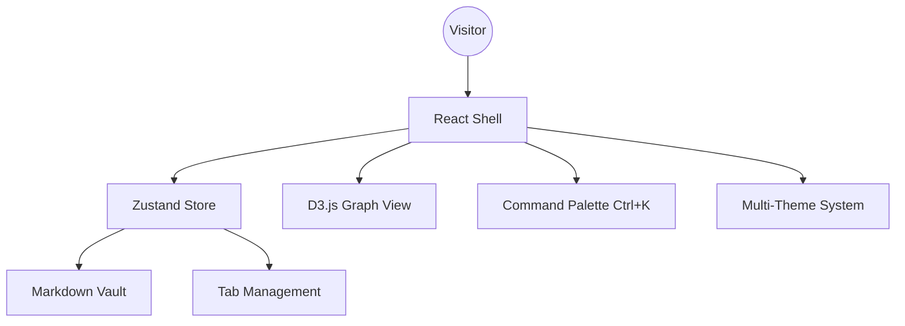
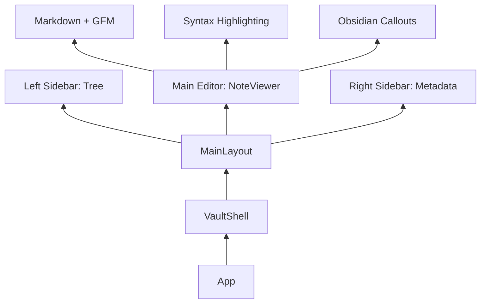

# Obsidian Portfolio: Digital Brain 🧠

A high-performance, Obsidian-inspired personal vault and portfolio built with React, TypeScript, and Tailwind CSS. This project serves as a "Second Brain" to showcase AI/ML expertise, automation builds, and technical field notes.

## 🚀 Architectural Overview

### System Flow


### Component Hierarchy


## 📂 Project Structure
```text
src/
├── components/          # UI Components
│   ├── layout/          # Main Shell & Layout
│   ├── editor/          # Markdown Rendering Engine
│   ├── graph/           # D3.js Visualization
│   └── ui/              # Command Palette & Switchers
├── hooks/               # Custom Hooks (useNotes, etc.)
├── store/               # Zustand State Management
├── vault/               # The Content (.md files)
│   ├── 00-identity/     # About & Resume
│   ├── 01-skills/       # Technical Stack
│   ├── 02-builds/       # Project Case Studies
│   └── ...
└── types/               # TypeScript Definitions
```

## 🛠 Branching Strategy (GitFlow Variant)
- **`main`**: Production-ready code. Stable releases.
- **`dev`**: Main integration branch for development.
- **`feature/*`**: Isolated development for specific features (e.g., `feature/ui-shell`).
- **`experiment/*`**: Disposable branches for UI/UX testing and design iterations.

## ✍️ Commit Convention
We follow **Conventional Commits**:
- `feat`: A new feature
- `fix`: A bug fix
- `chore`: Maintenance tasks (build config, dependencies)
- `docs`: Documentation changes
- `style`: Formatting, missing semi colons, etc; no code change
- `refactor`: Refactoring production code

*Example:* `feat(palette): add fuzzy search for vault nodes`

## 🧪 Development & Testing
```bash
# Install dependencies
npm install

# Start local dev server
npm run dev

# Verify build & types
npm run build
```

## 🎨 Design Experimentation
To experiment with UI changes without cluttering history:
1. Create an `experiment/` branch: `git checkout -b experiment/new-sidebar-style`
2. Squash commits when merging back to `dev` to keep history lean.
3. Use the **Theme System** (`src/index.css`) to test global color shifts.

## ✨ Future Roadmap
- [x] Interactive 3D Graph View
- [x] Fuzzy search integration in Command Palette
- [x] Real-time terminal simulation for `Contact_Node`
- [ ] PDF generation for project case studies
