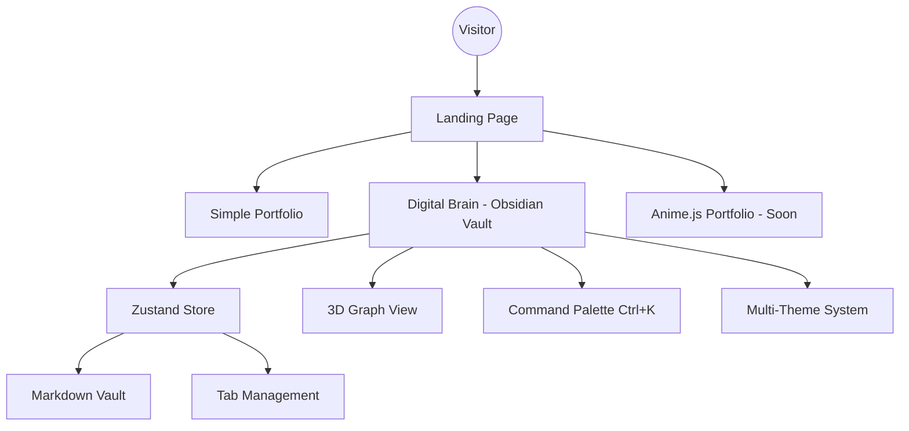
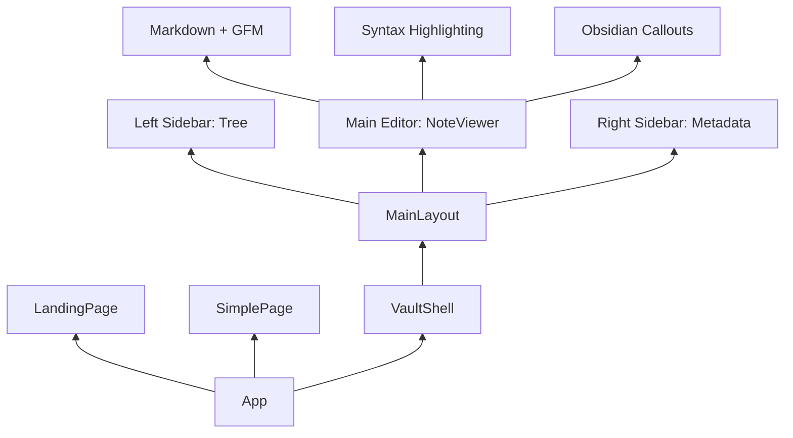

# Deep Shah - Portfolio 🧠

A multi-portal personal portfolio built with React, TypeScript, and Tailwind CSS. Visitors choose their experience from a central landing page - a clean glassmorphism portfolio for general audiences, or a full Obsidian-style technical vault for the tech-savvy.

**Live:** [deepshah1406.github.io](https://deepshah1406.github.io)

---

## 🗺 Portal Architecture

Three distinct experiences, one codebase. State-based routing (no router library) for full GitHub Pages compatibility.

```
Landing Page  /
├── Simple Portfolio    - Glassmorphism, HR-friendly, teal/cyan theme
├── Digital Brain       - Obsidian-style technical vault
└── Anime.js Portfolio  - Coming soon
```

### System Flow



### Component Hierarchy



---

## 📂 Project Structure

```text
src/
├── pages/               # Top-level portal views
│   ├── LandingPage.tsx  # Entry point - portal selector
│   └── SimplePage.tsx   # Glassmorphism HR-friendly portfolio
├── components/          # Obsidian vault UI components
│   ├── layout/          # Main Shell & Layout
│   ├── editor/          # Markdown Rendering Engine
│   ├── graph/           # 3D Force Graph (Three.js)
│   └── ui/              # Command Palette & Switchers
├── hooks/               # Custom Hooks (useNotes, etc.)
├── store/               # Zustand State Management
├── vault/               # Markdown content files
│   ├── 00-identity/     # About & Resume
│   ├── 01-skills/       # Technical Stack
│   ├── 02-builds/       # Project Case Studies
│   ├── 03-logs/         # Experience Logs
│   ├── 04-proof/        # Impact & Certifications
│   └── 05-access/       # Contact Node
└── types/               # TypeScript Definitions
```

---

## 🌿 Simple Portfolio - Features

- Teal/dark cyan glassmorphism design
- Light/dark mode toggle
- Animated hero with cycling roles
- Skills grid, 6 project cards, experience timeline
- Achievements and contact section
- Fully responsive

## 🧠 Digital Brain (Obsidian Vault) - Features

- Multi-tab navigation (VS Code style)
- Obsidian callouts: `[!ACHIEVEMENT]`, `[!TECH_STACK]`, `[!INFO]`
- Wiki-links: `[[NoteName]]` renders as clickable note links
- Interactive 3D force graph of all notes
- Command Palette (`Ctrl+K`) with fuzzy search
- Focus mode, 7 themes, terminal simulation
- Mobile responsive

---

## 🛠 Branching Strategy

| Branch | Purpose |
|---|---|
| `main` | Production - auto-deploys to GitHub Pages on push |
| `beta` | Active development and new feature integration |
| `feature/*` | Isolated development for specific features |
| `experiment/*` | Disposable branches for UI/UX testing |

---

## ✍️ Commit Convention

Standard readable commit messages:
- `feat`: A new feature
- `fix`: A bug fix
- `chore`: Maintenance tasks
- `docs`: Documentation changes
- `style`: Formatting, no logic change
- `refactor`: Refactoring production code

---

## 🧪 Development & Testing

```bash
# Install dependencies
npm install

# Start local dev server
npm run dev

# Verify build & types
npm run build
```

---

## ✨ Roadmap

- [x] Interactive 3D Graph View
- [x] Fuzzy search in Command Palette
- [x] Real-time terminal simulation on Contact Node
- [x] Dual-portal landing page
- [x] Glassmorphism simple portfolio with light/dark toggle
- [ ] Anime.js extraordinary portfolio
- [ ] PDF generation for project case studies
